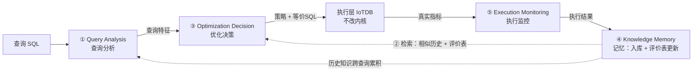

# MATAOF 系统工作流程说明（进展汇报版）

版本：2026-09-23，与当前最新代码一致
本文档回答三个问题：**系统做了什么、每个 Agent 如何决策、决策依据是什么**，
并逐步展示"上一个 Agent 的输出如何成为下一个 Agent 的输入"。
文中的 JSON 全部来自真实运行（IoTDB 2.0.6 + root.dbs 数据集）。

---

## 0. 系统是什么（30 秒版本）

**问题**：时序数据库的查询性能随查询特征（时间范围、设备数、过滤条件、聚合方式）
和数据分布动态变化，不存在对所有查询都最优的固定策略。

**做法**：把查询优化拆成四个职责单一的智能体，组成闭环：



- **① 分析**：看懂查询（特征提取），不做决策；
- **③ 决策**：在当前特征+历史经验下，从**有限候选策略空间**里选策略，输出可直接
  执行的等价 SQL；
- **执行层**：真实执行并采集指标（不改数据库内核）；
- **⑤ 监控**：整理"实际发生了什么"（效果判断、异常），不修改策略；
- **④ 记忆**：把每次执行沉淀为历史知识，供后续相似查询参考（不直接决策）。

---

## 1. Agent 之间的数据流转契约（谁输出什么 → 谁消费）

| 流转 | 上游输出（关键字段） | 下游消费方式 |
|---|---|---|
| ①分析 → ③决策 | `query_features`（六类特征）、`query_type`、`feature_vector`、`analysis_confidence` | 决策评分的全部"当前查询"依据 |
| ④记忆 → ③决策 | `matched_records_for_decision`（相似历史记录+延迟）、`strategy_evaluations`（策略评价表） | ①历史证据加权加分；②表级先验加分（D1） |
| ③决策 → 执行层 | `selected_strategy`：`strategy_id`（三维度策略组合）+ `equivalent_sql`（可直接执行的 SQL）+ 参数 | 优先执行 equivalent_sql，否则执行原查询 |
| 执行层 → ⑤监控 | 真实指标：延迟/CPU（平均+峰值）/内存（平均+峰值）/执行状态/失败原因 | 校验→对比→判断→异常 |
| ⑤监控 → ④记忆 | `performance_assessment`、metrics、anomalies | 装配成一条历史记录入库 |
| ④记忆 → 下次②检索 | 知识库（append-only）+ 策略评价表 | 相似度检索 + 累计成功率 |

**一个查询跑完后，所有环节的产物都写入结果文件**（`results/<目录>/<query_id>.json`），
任何决策都可事后审计。

---

## 2. 逐步详解（用一条真实查询走完全程）

示例查询：
```sql
SELECT s_1666 FROM root.dbs.g_0.d_0
WHERE root.dbs.g_0.d_0.s_1666 > -5.0
  AND time >= 1640966400000 AND time <= 1640966650000
```

### 第 1 步：Query Analysis Agent —— 看懂查询

**输入**：SQL 文本（+可选的数据库统计信息）。
**做什么**：sqlglot 确定性解析（不猜不编造），提取六类特征并标记未知项。

**真实输出节选**：
```json
{
  "query_type": "predicate_filter_query",
  "query_features": {
    "time":   {"has_time_filter": true, "time_span": 250000, "range_level": "narrow"},
    "device": {"device_count": 1, "multi_device": false},
    "filter": {"type_counts": {"value": 1, "time": 2}}
  },
  "unknown_features": ["选择率：数据库未提供选择率数据，不做估计", "..."],
  "analysis_confidence": 0.95,
  "feature_vector": {"dims": [...29 维...], "values": [0.415, 0.001, 0.2, ...]}
}
```

**决策依据从这里来**：时间范围窄（narrow）、1 个设备、1 个测点谓词 + 2 个时间条件；
选择率未知（数据库没给，如实标 unknown）；29 维特征向量供学习模型接口使用。

### 第 2 步：Knowledge Memory 检索 —— 找相似的历史经验

**输入**：① 的特征摘要 + 当前数据库/系统状态。
**做什么**：对知识库中**每条历史记录**计算多维相似度（查询特征 0.6 + 数据库状态
0.25 + 系统状态 0.15），按相似度分三档（强 ≥0.8 / 中 ≥0.5 / 弱 ≥0.3），
取 top-100 相似记录 + 输出策略评价表（累计成功率）。

**真实输出节选**（首次运行，知识库为空）：
```json
{"matched_count": 0, "knowledge_confidence": 0.0}
```
知识库有积累后（真实数据）：
```json
"strategy_evaluations": {"range_query|time_pruning|partition_pruning":
  {"count": 11, "success_ratio": 0.2727, "avg_latency_ms": 9.5}}
```
**注意**：历史是"证据"不是"规则"——只有相似上下文才参考，且按相似度加权。

### 第 3 步：Optimization Decision Agent —— 怎么选策略（核心）

**输入**：① 的特征 + ② 的历史证据 + 数据库状态 + 候选策略空间（封闭目录）。

**决策空间**（有界，禁止自造策略）：

| 维度 | 候选策略 |
|---|---|
| Time Pruning | full_scan（全扫）/ partition_pruning（分区裁剪）/ chunk_level_filtering（chunk 级过滤） |
| Filter Order | time_first（时间优先）/ device_tag_first（设备/标签优先） |
| Aggregation Placement | scan_level（扫描层）/ intermediate_level（中间层）/ final_level（最终层） |

**对每个维度的每个候选策略打分**：
```
score = base（结构性先验）
      + context（数据支撑加分：分区覆盖率、时间范围窄、选择率……无数据不加分）
      + history（相似历史证据：表现好加分、无证据微扣）
      + eval_prior（策略评价表先验：同类上下文累计成功率 → ±0.10，D1）
      + system（高负载调整） [+ llm_bonus（实验性 LLM 偏好，默认关）]
```
**安全门控**（评分高不等于可选）：中风险策略需数据支撑或历史证据，高风险策略
（chunk 级过滤）需 ≥2 条相似历史——证据不足就回退安全 baseline。

**真实输出节选**：
```json
{
  "decision": {
    "time_pruning": {
      "strategy": "partition_pruning",
      "reason": "时间边界已知（[1640966400000, 1640966650000]，跨度 250000 ms，narrow）；"
                "时间范围 narrow（+0.10）；分区覆盖 1.6%（≤25%，+0.10）；"
                "排除：chunk_level_filtering；在当前信息条件下选择 partition_pruning（score 0.75）。",
      "confidence": 0.65
    },
    "filter_order": {"strategy": "not_applicable",
                     "reason": "非时间过滤条件数为 1（<2），过滤顺序无意义"},
    "aggregation_placement": {"strategy": "not_applicable", "reason": "查询不含聚合"}
  },
  "selected_strategy": {
    "strategy_id": "time_pruning=partition_pruning|filter_order=not_applicable|aggregation_placement=not_applicable",
    "strategy_parameters": {"time_pruning": {"start_time": 1640966400000, "end_time": 1640966650000}},
    "equivalent_sql": "SELECT s_1666 FROM root.dbs.g_0.d_0 WHERE root.dbs.g_0.d_0.s_1666 > -5.0 AND time >= ..."
  }
}
```
**这段 reason 就是决策依据**：每条加分都对应一个可验证的事实；明确写
"在当前信息条件下选择"（不声称全局最优）。

### 第 4 步：执行层 —— 真实执行

**输入**：③ 的 `selected_strategy`。
**约定**：`equivalent_sql` 非空就执行它；同时（可配置）先执行一遍原查询作为
**真实 baseline** 对照。采集墙钟延迟、CPU/内存（执行期采样，平均+峰值）、
执行状态与失败原因（真实异常分类，分位数不编造）。

**真实输出节选**：
```json
"metrics": {"response_time_ms": 4.14, "cpu_utilization": 0.045,
            "cpu_utilization_peak": 0.045, "memory_utilization": 0.23, ...},
"baseline_metrics": {"response_time_ms": 10.78, ...}
```

### 第 5 步：Execution Monitoring Agent —— 整理事实

**输入**：执行层真实指标 + baseline。
**做什么**：指标校验 → baseline 对比（变化百分比）→ 效果判断（±5% 阈值：
improved / unchanged / degraded；执行失败 → failed；无数据 → insufficient_evidence）
→ 异常识别（只记录，不改策略）。

**真实输出节选**：
```json
{"performance_assessment": "improved",        // 4.14ms vs baseline 10.78ms
 "latency_change_percent": -61.6, "anomalies": []}
```

### 第 6 步：Knowledge Memory 更新 —— 记住这次执行

**输入**：① 分析 + ③ 决策 + ⑤ 监控 + 执行时间戳。
**做什么**：装配成一条历史记录（Query+特征+策略+执行结果+时间戳），
**append-only 入库**（不修改不删除）；同时把本次结果聚合进**策略评价表**——
这就是"执行反馈驱动策略权重调整"（D1）的机制。

**真实输出节选**：
```json
{"record_id": "rec00000001", "stored": true, "strategy_effect": "improved",
 "strategy_evaluation_updates": {
   "predicate_filter_query|time_pruning|partition_pruning":
     {"count": 1, "success_ratio": 1.0, "avg_latency_ms": 4.14}}}
```

### 闭环的效果（为什么越跑越准）

下一条相似查询到来时：② 检索会命中这些记录，③ 决策的 history 加分直接引用
它们的加权延迟；同时评价表的累计成功率变成表级先验（真实数据中曾出现
`策略评价表先验（同类上下文 11 次，成功率 0.2727，-0.05）`——反馈让评分
随真实表现动态修正）。执行结果越积累，决策依据越充分。

---

## 3. 关键技术设计一览（汇报要点）

| 设计点 | 一句话说明 |
|---|---|
| 有界策略空间 | 候选 = 输入候选 ∩ 固定目录（8 个策略），禁止自造，未知策略名拒绝 |
| 混合输出 | 决策输出 = 策略标识 + 可直接执行的等价 SQL（候选提供方生成，决策只选择）+ 执行级参数 |
| 证据可追溯 | 每条决策的 reason 引用具体数值（跨度/覆盖率/历史条数/成功率），证据清单落盘可审计 |
| 安全路径 | 证据不足→回退 baseline；高风险策略需强证据；无执行数据→如实 unknown 照常闭环 |
| 防虚构 | 全链路 unknown 标记；监控对 LLM 输出做数字级校验（数字必须⊆给定数据） |
| 动态权重（D1） | 策略评价表随反馈原子更新，映射为 ±0.10 有界先验参与评分（不参与门控） |
| 特征向量（D2） | 29 维固定契约向量（结构化特征并存），为学习模型预留标准接口 |
| LLM 增强 | 四 Agent 均有（语义摘要/决策解读/异常解读等），只写 llm_analysis 附加节，失败自动回退确定性路径；本地 Qwen3-8B 已验证 |
| 反馈闭环 | 分析→决策→执行→监控→记忆→检索→决策，append-only 知识库跨运行累积 |
| 可复现实验 | 每文件取样（seq/random+种子）、四模式切换（原生/固定策略/Agent/Agent+LLM）、批次统计报告（P50/P95/P99、吞吐、成功率、资源峰值） |

## 4. 实验运行方式（速查）

```bash
# 四模式切换（对应开题报告 3.4.1 三组对照 + LLM 变体）
bash scripts/run_experiment.sh --mode native   # Baseline 1：原生 IoTDB
bash scripts/run_experiment.sh --mode fixed    # Baseline 2：固定策略
bash scripts/run_experiment.sh --mode agent    # Ours：多智能体
bash scripts/run_experiment.sh --mode llm      # Ours + LLM 增强
# 公共参数：--query-dir / --scales / --files / --per-file-limit / --sample / --seed
```
每轮结束自动输出批次统计：查询数、总用时、吞吐、成功率、效果分布、
P50/P95/P99/平均/最大/最小延迟、baseline 延迟、CPU/内存平均与峰值。
